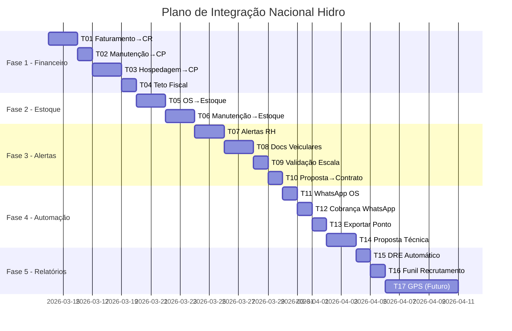

# 🗺️ Plano de Integração — Nacional Hidro

> **Baseado em:** `SISTEMA_ANALISE_COMPLETA.md`  
> **Objetivo:** Fechar todos os elos soltos entre módulos, automatizar fluxos e criar um ciclo financeiro completo  
> **Total:** 17 Tasks organizadas em 5 Fases

---

## Visão Geral das Fases

| Fase | Foco | Tasks | Impacto |
|------|------|-------|---------|
| **1** | 💰 Ciclo Financeiro Fechado | T01–T04 | Receita e despesa automáticas |
| **2** | 📦 Estoque Integrado | T05–T06 | Controle real de insumos |
| **3** | 🚨 Alertas e Compliance | T07–T10 | Evita multas e paradas operacionais |
| **4** | ⚡ Automação de Fluxo | T11–T14 | Reduz trabalho manual |
| **5** | 📊 Relatórios e Nice-to-have | T15–T17 | Visão gerencial |

---

## FASE 1 — 💰 Ciclo Financeiro Fechado

> Prioridade máxima. Fecha o loop: serviço executado → faturamento → financeiro.

---

### T01 — Faturamento → Contas a Receber (Automático)

**Problema:** Ao emitir faturamento (RL/NFSe), o lançamento no Contas a Receber é feito manualmente.  
**Resultado:** Ao criar/atualizar `Faturamento`, gera automaticamente `ContaReceber`.

**Backend:**
- **MODIFY** `faturamento.controller.ts`
  - No `create` e no `update` (quando status = "EMITIDA"):
    - Criar `ContaReceber` com:
      - `clienteId` do faturamento
      - `faturamentoId` referência
      - `valorOriginal` = `valorLiquido` do faturamento
      - `dataVencimento` = `dataVencimento` do faturamento
      - `descricao` = "Faturamento {numero} - {tipo}"
      - `notaFiscal` = número da nota
      - `status` = "PENDENTE"
  - Se já existir ContaReceber para esse faturamento, atualizar ao invés de duplicar

**Verificação:**
- No sistema: criar um faturamento e verificar se aparece automaticamente em `/financeiro` (aba Contas a Receber)
- Verificar que ao cancelar faturamento, a conta a receber é cancelada também

---

### T02 — Manutenção → Contas a Pagar (Automático)

**Problema:** Custos de manutenção ficam isolados, não refletem no financeiro.  
**Resultado:** Ao concluir manutenção com `valorTotal > 0`, gera `ContaPagar`.

**Backend:**
- **MODIFY** `manutencao.controller.ts`
  - Na atualização de status para "CONCLUIDA":
    - Se `valorTotal > 0`, criar `ContaPagar` com:
      - `categoria` = "MANUTENCAO"
      - `descricao` = "Manutenção {veículo.placa} - {descricao}"
      - `valorOriginal` = `valorTotal`
      - `centroCusto` = placa do veículo ou centro de custo vinculado
      - `dataVencimento` = `dataPagamento` ou data atual + 30 dias
      - `status` = "ABERTO"

**Verificação:**
- Criar manutenção com valor, concluir, verificar se aparece em Contas a Pagar

---

### T03 — Hospedagem/Passagem → Contas a Pagar (Automático)

**Problema:** Reservas de hotel e passagens não geram lançamentos financeiros.  
**Resultado:** Ao cadastrar hospedagem ou passagem, gera `ContaPagar` automaticamente.

**Backend:**
- **MODIFY** `hospedagem.controller.ts`
  - No `create`:
    - Se `valorTotal > 0`, criar `ContaPagar` com:
      - `categoria` = "HOSPEDAGEM" ou "PASSAGEM"
      - `descricao` = "Hospedagem {hotel} - {funcionário}"
      - `valorOriginal` = `valorTotal`
      - `centroCusto` = OS vinculada ou "VIAGEM"
      - `dataVencimento` = `dataCheckin`

- **NEW** Criar lógica similar para `Passagem` (atualmente sem controller dedicado)
  - Criar `passagem.controller.ts` e `passagem.routes.ts`
  - CRUD de passagens + auto-geração de `ContaPagar`

**Schema (se necessário):**
- Verificar se model `Passagem` já está no schema → ✅ já existe

**Verificação:**
- Cadastrar hospedagem com valor → verificar conta a pagar criada
- Cadastrar passagem com valor → verificar conta a pagar criada

---

### T04 — Alerta de Teto Fiscal por CNPJ em Tempo Real

**Problema:** Comercial não sabe se empresa está perto do limite fiscal.  
**Resultado:** Indicador em tempo real ao criar proposta/faturamento.

**Backend:**
- **NEW** `tetoFiscal.controller.ts`
  - Endpoint `GET /empresas/:id/teto-fiscal`
    - Soma todo `Faturamento.valorBruto` do mês atual para aquele CNPJ
    - Compara com `EmpresaCNPJ.limiteMenusal`
    - Retorna: `{ usado, limite, percentual, alerta: true/false }`

**Frontend:**
- **MODIFY** `Faturamento.tsx` — Adicionar badge/alerta visual ao selecionar empresa
- **MODIFY** `Propostas.tsx` — Mostrar indicador ao selecionar empresa de faturamento
- **MODIFY** `EmpresasPage.tsx` — Dashboard com barra de progresso do teto por CNPJ

**Verificação:**
- Na página de empresas, verificar barra de progresso do teto
- Ao criar faturamento, verificar alerta quando teto > 80%

---

## FASE 2 — 📦 Estoque Integrado

> Conecta estoque às operações e manutenção.

---

### T05 — OS → Baixa de Estoque (Materiais Utilizados)

**Problema:** Materiais usados na execução de OS não dão baixa no estoque.  
**Resultado:** Na baixa da OS, vincular materiais e criar movimentações de saída.

**Schema:**
- **MODIFY** `schema.prisma`
  - Adicionar ao model `OrdemServico`:
    ```
    materiaisUtilizados MaterialOS[]
    ```
  - **NEW** model `MaterialOS`:
    ```
    id          String  @id @default(uuid())
    osId        String
    os          OrdemServico @relation(...)
    produtoId   String
    produto     Produto @relation(...)
    quantidade  Int
    createdAt   DateTime @default(now())
    ```

**Backend:**
- **MODIFY** `os.controller.ts`
  - Novo endpoint `POST /os/:id/materiais` — vincular materiais
  - Na baixa da OS: criar `MovimentacaoEstoque` (tipo: SAIDA, motivo: USO_EM_OS) para cada material
  - Atualizar `Produto.estoqueAtual` automaticamente

**Frontend:**
- **MODIFY** `OS.tsx` — Adicionar aba/seção "Materiais Utilizados" com seleção de produtos do estoque

**Verificação:**
- Vincular produto a OS → baixar OS → verificar que estoque diminuiu

---

### T06 — Manutenção → Consumo de Peças do Estoque

**Problema:** Peças usadas em manutenção não saem do estoque.  
**Resultado:** Ao registrar peças na manutenção, baixa estoque automaticamente.

**Schema:**
- **MODIFY** `schema.prisma`
  - Adicionar ao model `Manutencao`:
    ```
    pecasUtilizadas PecaManutencao[]
    ```
  - **NEW** model `PecaManutencao`:
    ```
    id            String  @id @default(uuid())
    manutencaoId  String
    manutencao    Manutencao @relation(...)
    produtoId     String
    produto       Produto @relation(...)
    quantidade    Int
    valorUnitario Decimal @db.Decimal(10, 2)
    createdAt     DateTime @default(now())
    ```

**Backend:**
- **MODIFY** `manutencao.controller.ts`
  - Novo endpoint `POST /manutencao/:id/pecas`
  - Ao concluir manutenção: baixar estoque de cada peça
  - Somar valor das peças em `custoPecas`

**Frontend:**
- **MODIFY** `Manutencao.tsx` — Seção "Peças Utilizadas" com busca no estoque

**Verificação:**
- Adicionar peças a manutenção → concluir → estoque decrementou

---

## FASE 3 — 🚨 Alertas e Compliance

> Automações que evitam multas e problemas operacionais.

---

### T07 — Cron de Alertas: ASO, Férias, Experiência

**Problema:** Alertas de ASO vencida, férias vencendo e período de experiência (45/90 dias) são manuais.  
**Resultado:** Job diário que gera alertas visuais + notificação WhatsApp.

**Backend:**
- **NEW** `src/jobs/alertasRH.job.ts`
  - Cron diário (ex: 07:00):
    - Busca `ASOControle` com `dataVencimento` nos próximos 30/15/0 dias
    - Busca `Funcionario` com `dataAdmissao` há 40-45 dias e 85-90 dias
    - Busca `ControleFerias` com `dataVencimento` nos próximos 30 dias
    - Gera registros em nova tabela `AlertaRH` ou atualiza dashboard
    - Envia WhatsApp via Evolution API para gestores

**Frontend:**
- **MODIFY** `RH.tsx` ou `Dashboard.tsx`
  - Cards de alerta: "3 ASOs vencendo esta semana", "2 funcionários em período de experiência"
  - Indicadores visuais (🔴 vencido, 🟡 vencendo, 🟢 ok)

**Verificação:**
- Criar funcionário com ASO vencendo em 10 dias → executar job → verificar alerta no dashboard

---

### T08 — Documentos Veiculares (CRLV, ANTT, Tacógrafo) + Alertas

**Problema:** Sem controle de vencimento de documentos dos veículos.  
**Resultado:** Campos de documentos no veículo + alertas automáticos.

**Schema:**
- **MODIFY** `schema.prisma` — model `Veiculo`:
  - Adicionar campos:
    ```
    crlvVencimento      DateTime?
    anttVencimento      DateTime?
    tacografoVencimento  DateTime?
    seguroVencimento     DateTime?
    ultimaInspecao       DateTime?
    documentosJson       Json?  // Array de { tipo, numero, emissao, vencimento }
    ```

**Backend:**
- **MODIFY** `logistica.controller.ts` — CRUD dos novos campos
- **MODIFY** `src/jobs/alertasRH.job.ts` → renomear para `alertas.job.ts`
  - Adicionar verificação de documentos veiculares vencendo

**Frontend:**
- **MODIFY** `Logistica.tsx` ou `FrotaMap.tsx`
  - Aba "Documentos" em cada veículo
  - Dashboard com indicadores de vencimento

**Verificação:**
- Cadastrar veículo com CRLV vencendo em 15 dias → verificar alerta

---

### T09 — Validação na Escala: Bloquear Funcionário Sem Integração/ASO

**Problema:** Funcionário com ASO vencida ou integração vencida pode ser escalado.  
**Resultado:** Ao criar escala, validar e alertar/bloquear.

**Backend:**
- **MODIFY** `logistica.controller.ts` (criação de escala)
  - Antes de salvar escala:
    - Verificar se funcionários selecionados têm ASO válida
    - Verificar integrações do cliente válidas
    - Retornar warning (alerta) ou error (bloqueio) conforme configuração

**Frontend:**
- **MODIFY** `Logistica.tsx`
  - Modal de confirmação: "⚠️ Fulano tem ASO vencida. Confirmar mesmo assim?"
  - Indicador visual na lista de funcionários (🔴/🟡/🟢)

**Verificação:**
- Escalar funcionário com ASO vencida → verificar alerta/bloqueio

---

### T10 — Auto-gerar Contrato ao Aceitar Proposta

**Problema:** Contrato é criado manualmente após aceitar proposta.  
**Resultado:** Ao mudar proposta para ACEITA, gera `Contrato` automaticamente.

**Backend:**
- **MODIFY** `proposta.controller.ts`
  - No endpoint `PATCH /:id/status`, quando `status = "ACEITA"`:
    - Criar `Contrato` com:
      - `codigo` = "CTR-{ano}-{seq}"
      - `clienteId` da proposta
      - `objeto` = introdução/objetivo da proposta
      - `valorMensal` = `valorTotal` / meses
      - `dataInicio` = hoje
      - `dataVencimento` = `dataValidade` da proposta ou +1 ano
      - `status` = "ATIVO"

**Verificação:**
- Mudar status de proposta para ACEITA → verificar contrato criado em `/contratos`

---

## FASE 4 — ⚡ Automação de Fluxo

> Reduz trabalho manual repetitivo.

---

### T11 — WhatsApp Automático em Mudança de Status da OS

**Problema:** Motorista e cliente não são notificados automaticamente.  
**Resultado:** Ao mudar status da OS, dispara WhatsApp via Evolution API.

**Backend:**
- **MODIFY** `os.controller.ts`
  - Após atualizar status:
    - Se `ABERTA → EM_EXECUCAO`: WhatsApp para motorista "Sua OS {codigo} iniciou"
    - Se `EM_EXECUCAO → BAIXADA`: WhatsApp para contato do cliente "Serviço concluído"
    - Se `CANCELADA`: WhatsApp para motorista + cliente
  - Usar `whatsapp.service.ts` existente

**Verificação:**
- Mudar status de OS → verificar mensagem no log de notificações

---

### T12 — Cobrança de Medição via WhatsApp (além do email)

**Problema:** Cobrança de medição é apenas por email.  
**Resultado:** Adicionar canal WhatsApp na régua de cobrança.

**Backend:**
- **MODIFY** `src/jobs/cobrancaAutomatica.job.ts`
  - Após enviar email, se `dias_atraso > 5`:
    - Enviar WhatsApp via Evolution API para contato do cliente
    - Registrar em `HistoricoCobranca` com `tipo = "WHATSAPP"`

**Verificação:**
- Medição pendente > 5 dias → executar job → verificar log de WhatsApp

---

### T13 — Exportação Ponto Eletrônico → Relatório para Contabilidade

**Problema:** Dados de ponto ficam isolados, sem exportação.  
**Resultado:** Botão de exportação mensal em Excel/PDF.

**Backend:**
- **NEW** endpoint `GET /ponto-eletronico/relatorio?mes=3&ano=2026`
  - Gera dados consolidados: total horas, HE, faltas, por funcionário
  - Retorna JSON para frontend ou gera Excel (xlsx)

**Frontend:**
- **MODIFY** `PontoEletronicoPage.tsx`
  - Botão "Exportar Relatório Mensal"
  - Filtros: mês, ano, departamento

**Verificação:**
- Lançar pontos de funcionários → exportar relatório → verificar Excel gerado

---

### T14 — Proposta Técnica Separada (Anexo da Comercial)

**Problema:** Proposta técnica é feita manualmente fora do sistema.  
**Resultado:** Suporte no sistema para gerar proposta técnica vinculada à comercial.

**Backend:**
- Já existe campo `tipoProposta` (COMERCIAL, TECNICA) e campos como `escopoTecnico`, `dimensionamentoEquipe` no model `Proposta` ✅
- **MODIFY** `proposta.controller.ts` — Garantir que ao duplicar, campo `propostaComercialId` funciona

**Frontend:**
- **MODIFY** `Propostas.tsx`
  - Botão "Gerar Proposta Técnica" a partir de uma comercial existente
  - Template sem valores, com campos: escopo, dimensionamento, equipamentos, dias
  - PDF gerado sem valores monetários

**Verificação:**
- A partir de proposta comercial → gerar técnica → verificar PDF sem valores

---

## FASE 5 — 📊 Relatórios e Nice-to-have

---

### T15 — DRE Mensal Automático por Email

**Backend:**
- **NEW** `src/jobs/dreMensal.job.ts`
  - Cron mensal (dia 5, 08:00): gerar DRE do mês anterior, enviar por email para diretoria

---

### T16 — Relatório de Taxa de Conversão do Recrutamento

**Frontend:**
- **MODIFY** `RelatoriosRHPage.tsx`
  - Gráfico funil: Triagem → Entrevista → Aprovado → Admitido
  - KPIs: tempo médio de contratação, taxa de conversão por etapa

---

### T17 — Integração GPS/Rastreador (Futuro)

**Escopo:** Pesquisar API do Orce GPS para integrar posição em tempo real no `FrotaMap.tsx`.  
**Status:** Depende de API aberta do fornecedor de rastreamento.

---

## Cronograma Sugerido



---

## Checklist de Progresso

- [ ] **T01** — Faturamento → Contas a Receber automático
- [ ] **T02** — Manutenção → Contas a Pagar automático
- [ ] **T03** — Hospedagem/Passagem → Contas a Pagar automático
- [ ] **T04** — Alerta de teto fiscal por CNPJ
- [ ] **T05** — OS → Baixa de estoque (materiais)
- [ ] **T06** — Manutenção → Consumo de peças do estoque
- [ ] **T07** — Cron de alertas RH (ASO, férias, experiência)
- [ ] **T08** — Documentos veiculares + alertas
- [ ] **T09** — Validação de escala (ASO/integração)
- [ ] **T10** — Proposta aceita → Contrato automático
- [ ] **T11** — WhatsApp automático em status da OS
- [ ] **T12** — Cobrança de medição via WhatsApp
- [ ] **T13** — Exportação ponto eletrônico
- [ ] **T14** — Proposta técnica no sistema
- [ ] **T15** — DRE mensal por email
- [ ] **T16** — Funil de conversão recrutamento
- [ ] **T17** — Integração GPS (futuro)
