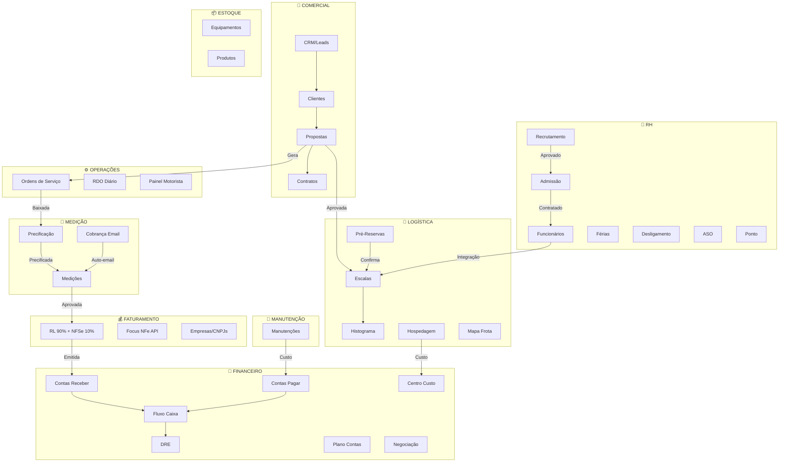
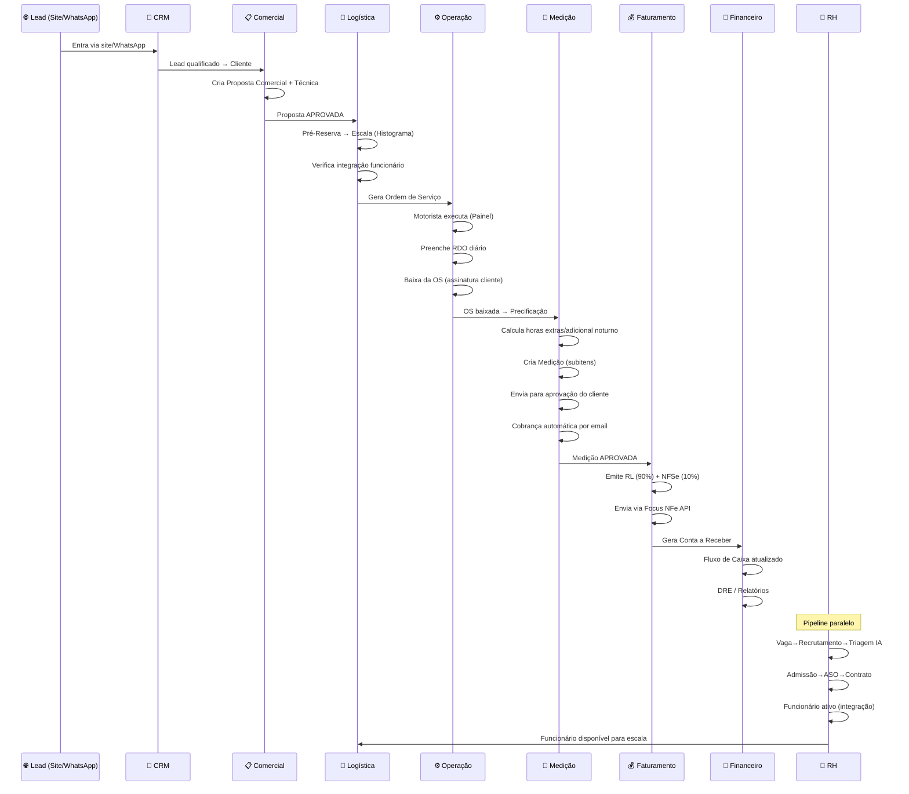

# 🏭 Sistema Nacional Hidro — Análise Completa

> **Data:** 13/03/2026 | **Stack:** React/Vite + Node.js/Express/Prisma/PostgreSQL  
> **53 páginas frontend** | **50 rotas backend** | **40+ modelos Prisma**

---

## 1. Mapa Geral dos Módulos



---

## 2. Status de Cada Módulo

### Legenda
- ✅ Implementado e funcional
- 🟡 Implementado parcialmente — faltam integrações
- 🔴 Não implementado / planejado

| # | Módulo | Status | Páginas Frontend | Rotas Backend | Observações |
|---|--------|--------|------------------|---------------|-------------|
| 1 | **Comercial/CRM** | ✅ | `CRM.tsx`, `Clientes.tsx`, `Propostas.tsx`, `Contratos.tsx` | `crm`, `cliente`, `proposta`, `contrato` | Propostas técnicas separadas das comerciais. Suporte a propostas globais (matriz→filiais). |
| 2 | **Logística** | ✅ | `Logistica.tsx`, `Histograma.tsx`, `PreReservaPage.tsx`, `HospedagemPage.tsx`, `FrotaMap.tsx`, `DashboardLogistica.tsx` | `logistica`, `instograma`, `preReserva`, `hospedagem`, `dashboardLogistica` | Histograma visual de escalas. Pré-reservas sem proposta. |
| 3 | **Operações** | ✅ | `OS.tsx`, `RDO.tsx`, `PainelMotorista.tsx` | `os`, `rdo`, `painelMotorista` | Painel motorista com checkpoints. RDO vinculado à OS. |
| 4 | **Medição/Precificação** | ✅ | `Precificacao.tsx`, `Medicoes.tsx`, `CobrancaPage.tsx` | `precificacao`, `medicao`, `cobranca` | Cobrança automática por email. Medição com subitens (HE, adicional noturno). |
| 5 | **Faturamento** | ✅ | `Faturamento.tsx`, `EmpresasPage.tsx` | `faturamento` | Integração Focus NFe. Split 90% RL + 10% NFSe. Teto fiscal por CNPJ. |
| 6 | **Financeiro** | ✅ | `FinanceiroPage.tsx`, `FluxoCaixa.tsx`, `FluxoCaixaDiario.tsx`, `DrePage.tsx`, `PlanoContasPage.tsx`, `CentroCustoPage.tsx`, `ContasBancariasPage.tsx`, `ImportacaoXMLPage.tsx`, `DashboardFinanceiroPage.tsx`, `Fornecedores.tsx` | `financeiro`, `fluxoCaixa`, `dre`, `planoContas`, `centroCusto`, `contaBancaria`, `importacaoXml`, `dashboardFinanceiro`, `fornecedor` | Contas a pagar/receber, DRE, fluxo de caixa, importação XML. |
| 7 | **RH** | ✅ | `RH.tsx`, `Recrutamento.tsx`, `TriagemIAPage.tsx`, `AdmissaoPage.tsx`, `FeriasPage.tsx`, `DesligamentoPage.tsx`, `ASOControlePage.tsx`, `PontoEletronicoPage.tsx`, `RelatoriosRHPage.tsx`, `InscricaoPublica.tsx`, `FuncionarioForm.tsx` | `rh`, `recrutamento`, `triagemIA`, `admissao`, `ferias`, `desligamento`, `pontoEletronico`, `relatorios-rh` | Pipeline completo: vaga→triagem IA→entrevista→admissão→funcionário→desligamento. |
| 8 | **Estoque** | 🟡 | `EstoqueEquipamentos.tsx`, `Estoque.tsx` | `estoque`, `equipamento` | Movimentação básica. Falta integração com OS e Manutenção. |
| 9 | **Manutenção** | 🟡 | `Manutencao.tsx` | `manutencao` | Custo financeiro parcial. Falta vínculo com estoque de peças. |
| 10 | **Administração** | ✅ | `Usuarios.tsx`, `Configuracoes.tsx`, `AuditLog.tsx`, `Monitor.tsx`, `WhatsAppPage.tsx`, `MigracaoPage.tsx`, `CadastrosAuxiliares.tsx` | `auth`, `equipe`, `categoria`, `configuracao`, `auditLog`, `monitor`, `whatsapp`, `webhook`, `migracao` | Permissões por categoria. WhatsApp Evolution API. |

---

## 3. Fluxo Operacional Completo (Ponta a Ponta)



---

## 4. Integrações Existentes Entre Módulos

| De → Para | Tipo | Status | Descrição |
|-----------|------|--------|-----------|
| **CRM → Cliente** | Automática | ✅ | Lead qualificado vira cadastro de cliente |
| **Cliente → Proposta** | Automática | ✅ | Proposta puxa dados do cliente cadastrado |
| **Proposta → OS** | Semi-auto | ✅ | OS gerada vinculada à proposta/escala |
| **Proposta → Histograma** | Automática | ✅ | Escala aparece no histograma visual |
| **Pré-Reserva → Escala** | Manual | ✅ | Usuário confirma e vincula |
| **OS → Precificação** | Automática | ✅ | Baixa da OS envia para precificação |
| **Precificação → Medição** | Semi-auto | ✅ | OS precificadas agrupadas em medição |
| **Medição → Email Cobrança** | Automática | ✅ | Cron job envia emails de cobrança |
| **Medição → Faturamento** | Automática | ✅ | Aprovação gera itens para faturar (RL+NFSe) |
| **Faturamento → Focus NFe** | Automática | ✅ | Emissão de NFSe via API Focus |
| **Faturamento → Contas Receber** | Semi-auto | 🟡 | Requer lançamento manual no financeiro |
| **OS → RDO** | Automática | ✅ | RDO vinculado à OS por dia/turno |
| **Recrutamento → Admissão** | Automática | ✅ | Candidato aprovado → pipeline admissão |
| **Admissão → Funcionário** | Semi-auto | ✅ | Etapa final cria registro de funcionário |
| **Funcionário → Integração** | Manual | ✅ | Registra integrações por cliente |
| **Manutenção → Veículo** | Automática | ✅ | Atualiza status do veículo |
| **Manutenção → Financeiro** | 🔴 Ausente | 🔴 | Custo de manutenção não gera conta a pagar |
| **Estoque → OS** | 🔴 Ausente | 🔴 | Materiais usados na OS não baixam estoque |
| **Estoque → Manutenção** | 🔴 Ausente | 🔴 | Peças de manutenção não consomem estoque |
| **Hospedagem → Financeiro** | 🔴 Ausente | 🔴 | Despesas de hotel não geram contas a pagar |
| **RH → Folha** | 🔴 Ausente | 🔴 | Sem integração com contabilidade/folha |
| **Faturamento → Contas Receber** | 🔴 Parcial | 🟡 | Automatizar geração de CR ao faturar |
| **Ponto → Folha** | 🔴 Ausente | 🔴 | Sem exportação do ponto para folha |

---

## 5. Automações Existentes

| Automação | Trigger | Canal | Status |
|-----------|---------|-------|--------|
| Cobrança de medição | Medição pendente > X dias | Email | ✅ Ativo (`cobrancaAutomatica.job.ts`) |
| Alertas WhatsApp | Webhook site/leads | WhatsApp (Evolution API) | ✅ Ativo |
| Triagem IA de candidatos | Candidato inscrito | Sistema interno | ✅ Ativo (`triagemIA.controller.ts`) |
| Emissão NFSe automática | Faturamento aprovado | Focus NFe API | ✅ Ativo |
| Webhook de Leads (site) | Formulário site | Webhook → Lead | ✅ Ativo |
| Notificação pré-reserva WhatsApp | Mensagem manual | WhatsApp | ✅ Parcial |
| Auditoria de alterações | Qualquer CRUD | Log interno | ✅ Ativo (`LogAlteracao`) |

---

## 6. 🔴 Gaps de Integração e Automação (O que falta)

### 6.1 Integrações Ausentes Críticas

#### 🔴 1. Faturamento → Contas a Receber (Automático)
**Problema:** Ao emitir faturamento, o lançamento no Contas a Receber é manual.  
**Solução:** Ao criar `Faturamento`, gerar automaticamente `ContaReceber` com cliente, valor, vencimento, e referência da NF.

#### 🔴 2. Manutenção → Contas a Pagar
**Problema:** Custos de manutenção (peças + mão de obra) não geram automaticamente contas a pagar.  
**Solução:** Ao concluir manutenção, se `valorTotal > 0`, gerar `ContaPagar` com fornecedor, categoria "MANUTENCAO", centro de custo do veículo.

#### 🔴 3. Hospedagem/Passagem → Contas a Pagar
**Problema:** Reservas de hotel e passagens ficam isoladas, sem reflexo financeiro.  
**Solução:** Ao cadastrar hospedagem/passagem, gerar `ContaPagar` linkada ao fornecedor (hotel), com centro de custo da OS.

#### 🔴 4. Estoque → OS (Baixa Automática)
**Problema:** Materiais usados na execução de OS não dão baixa no estoque.  
**Solução:** No fechamento de OS, permitir vincular itens de estoque. Ao baixar OS, criar `MovimentacaoEstoque` tipo SAIDA motivo "USO_EM_OS".

#### 🔴 5. Estoque → Manutenção (Consumo de Peças)
**Problema:** Peças usadas em manutenção não saem do estoque.  
**Solução:** No registro de manutenção, vincular produtos. Ao concluir, baixar estoque automaticamente.

#### 🔴 6. Ponto Eletrônico → Relatório para Contabilidade
**Problema:** Dados de ponto ficam isolados no sistema, sem exportação para folha.  
**Solução:** Gerar relatório mensal exportável (Excel/PDF) com: total horas, HE, faltas, por funcionário.

#### 🔴 7. Férias/ASO → Alertas Automáticos
**Problema:** Alertas de vencimento de experiência (45/90 dias), ASO e férias são manuais.  
**Solução:** Cron job diário que verifica `ASOControle.dataVencimento`, `ControleFerias.dataVencimento`, e data de admissão para alertas visuais e WhatsApp.

#### 🔴 8. Proposta → Contrato (Automático)
**Problema:** Ao aceitar proposta, o contrato é gerado manualmente.  
**Solução:** Quando proposta muda status para ACEITA, gerar automaticamente `Contrato` com dados da proposta.

### 6.2 Automações Planejadas mas Ausentes

| Automação | Impacto | Prioridade |
|-----------|---------|------------|
| WhatsApp automático ao trocar status de OS | Alto — motorista e cliente informados em tempo real | 🔴 Alta |
| Alerta de teto fiscal atingido (empresa/CNPJ) | Alto — evita problemas tributários | 🔴 Alta |
| Alerta de vencimento de documentos veiculares (CRLV, ANTT, tacógrafo) | Alto — compliance | 🔴 Alta |
| Alerta de ASO vencendo (15/30 dias antes) | Alto — não pode escalar funcionário com ASO vencida | 🔴 Alta |
| Alerta de férias vencendo / período experiência | Médio — planejamento RH | 🟡 Média |
| NotificaçãoWhatsApp de cobrança de medição ao cliente | Médio — complemento ao email | 🟡 Média |
| Relatório semanal automático de frota (km, manutenção) | Baixo — gestão | 🟢 Baixa |
| Exportação automática DRE mensal | Baixo — relatório | 🟢 Baixa |

---

## 7. Fluxo por Setor — Detalhamento

### 🤝 COMERCIAL
```
Lead (WhatsApp/Site) → CRM (Kanban de status)
                         ↓
                    Cliente cadastrado (PF/PJ, matriz/filial)
                         ↓
                    Proposta Comercial (RL 90% + NFSe 10%)
                    + Proposta Técnica (sem valores, anexo)
                         ↓ (tipos: hora, diária, preço fechado)
                    Status: RASCUNHO → ENVIADA → ACEITA
                         ↓
                    [Proposta Global para contratos corporativos]
                    [Cada unidade = proposta filha]
```

### 🚚 LOGÍSTICA
```
Proposta APROVADA
    ↓
Pré-Reserva (sem proposta, apenas data+caminhão+nome)
    ↓ (confirmação)
Escala → Histograma visual (por placa/equipamento)
    ↓ (verificações)
    ├── Veículo disponível?
    ├── Funcionário com integração válida?
    ├── ASO em dia?
    └── Documentação OK?
    ↓
Gera Ordem de Serviço (vinculada à proposta)
    ↓
Imprime ou envia digitalmente
    ↓
Hospedagem/Passagem (se serviço fora)
```

### ⚙️ OPERAÇÕES
```
OS recebida pelo motorista/operador
    ↓
Painel Motorista → Check-in (saiu da base)
    ↓
Check-in no cliente (chegou na portaria)
    ↓
RDO diário (horários, atividades, condições)
    ↓
Assinatura do cliente (digital)
    ↓
Baixa da OS (status: BAIXADA)
    ↓
Justificativa de falha (se não executou)
```

### 📐 MEDIÇÃO & PRECIFICAÇÃO
```
OS Baixada → Precificação
    ↓
Leitura da proposta comercial
    ├── Valor hora × horas trabalhadas
    ├── Horas extras (+ 35% noturno, +50% FDS)
    ├── Diária vs preço fechado
    └── Subitens de cobrança
    ↓
Medição criada (agrupamento de OS)
    ├── Status: EM_ABERTO → EM_CONFERENCIA → AGUARDANDO_APROVACAO
    ├── Aprovação parcial (30%, 50%, etc.)
    ├── Contestação → renegociação
    └── Cobrança automática via email
    ↓
Medição APROVADA → Faturamento
```

### 💰 FATURAMENTO
```
Medição Aprovada
    ↓
Split automático:
    ├── 90% → RL (Recibo de Locação) - gerado internamente
    └── 10% → NFSe (via Focus NFe API) - validação SEFAZ
    ↓
Seleção da empresa (CNPJ): Hidrosaneamento ou Locação
    ↓ (verificação de teto fiscal)
Emissão da nota
    ↓
Envio por email ao cliente (PDF + XML)
    ↓
Conta a Receber gerada
```

### 🏦 FINANCEIRO
```
Entradas:
    ├── Contas a Receber (faturamento aprovado)
    ├── Importação XML (NFs de entrada)
    └── Lançamentos manuais

Saídas:
    ├── Contas a Pagar (fornecedores, manutenção, hospedagem)
    ├── Parcelamento automático
    └── Baixa total/parcial

Relatórios:
    ├── Fluxo de Caixa (diário e mensal)
    ├── DRE (por centro de custo)
    ├── Dashboard Financeiro (KPIs)
    └── Plano de Contas hierárquico
    
Cobrança/Negociação:
    ├── Régua de cobrança (email, WhatsApp, ligação)
    ├── Negociação de dívidas (parcelamento)
    ├── Assinatura digital de acordo
    └── Alertas de quebra de acordo
```

### 👥 RECURSOS HUMANOS
```
Abertura de Vaga (gestor solicita)
    ↓
Recrutamento (Kanban):
    TRIAGEM → PRE_CONSULTA → ENTREVISTA_RH → ENTREVISTA_GESTOR → TESTE_PRATICO
    ↓
    ├── Triagem IA (score automático)
    ├── Link direto WhatsApp
    ├── Inscrição pública (formulário)
    └── APROVADO ou REPROVADO (com motivo)
    ↓
Admissão (Pipeline):
    ENVIO_DOCUMENTACAO → CONFERENCIA → EXAME_ASO → CONTABILIDADE → ASSINATURA_CONTRATO → CONTRATADO
    ↓
Funcionário ATIVO
    ├── Ponto Eletrônico (entrada1/saida1/entrada2/saida2)
    ├── Controle de Férias (período aquisitivo, vendas, gozo)
    ├── ASO Periódico (alerta de vencimento)
    ├── Integrações por cliente (NR-35, etc.)
    ├── Benefícios (refeiçao, VT)
    └── Categorização (MOTORISTA, OPERADOR, JATISTA, etc.)
    ↓
Desligamento (Pipeline):
    SOLICITACAO → AVISO_PREVIO → EXAME_DEMISSIONAL → DOCUMENTACAO → RESCISAO → HOMOLOGACAO → CONCLUIDO
```

---

## 8. Modelo de Dados — Relações-Chave

```mermaid
erDiagram
    Cliente ||--o{ Proposta : "tem"
    Cliente ||--o{ OrdemServico : "tem"
    Cliente ||--o{ Contrato : "tem"
    Cliente ||--o{ Medicao : "tem"
    Cliente ||--o{ Faturamento : "tem"
    Cliente ||--o{ ContaReceber : "tem"
    Cliente ||--o{ Escala : "tem"

    Proposta ||--o{ OrdemServico : "gera"
    Proposta ||--o{ PropostaItem : "itens"
    Proposta ||--o{ Proposta : "unidades filhas"

    OrdemServico ||--o{ ServicoOS : "serviços"
    OrdemServico ||--o{ ItemCobranca : "cobrança"
    OrdemServico ||--o{ RDO : "diários"
    OrdemServico ||--o| Manutencao : "manutenção"
    OrdemServico ||--o| Logistica : "logística"

    Medicao ||--o{ OrdemServico : "agrupa"
    Medicao ||--o{ CobrancaEmail : "cobranças"

    Faturamento }o--|| Cliente : "fatura"

    Funcionario ||--o{ IntegracaoCliente : "integrações"
    Funcionario ||--o{ Admissao : "admissões"
    Funcionario ||--o{ ControleFerias : "férias"
    Funcionario ||--o{ ASOControle : "ASOs"
    Funcionario ||--o{ Desligamento : "desligamentos"
    Funcionario ||--o{ Afastamento : "afastamentos"

    Vaga ||--o{ Candidato : "candidatos"
    Candidato ||--o| Admissao : "admissão"

    Veiculo ||--o{ Escala : "escalas"
    Veiculo ||--o{ Manutencao : "manutenções"

    Fornecedor ||--o{ ContaPagar : "títulos"
    ContaReceber ||--o{ NegociacaoDivida : "negociações"
    NegociacaoDivida ||--o{ ParcelaNegociacao : "parcelas"
    ContaReceber ||--o{ HistoricoCobranca : "cobranças"

    CentroCusto ||--o{ LancamentoCusto : "lançamentos"
    PlanoContas ||--o{ LancamentoCusto : "lançamentos"
```



---

## 9. Resumo de Ações Recomendadas (Prioridade)

### 🔴 PRIORIDADE ALTA (Impacto financeiro direto)

| # | Ação | De→Para | Esforço |
|---|------|---------|---------|
| 1 | Auto-gerar `ContaReceber` ao faturar | Faturamento→Financeiro | Médio |
| 2 | Auto-gerar `ContaPagar` ao concluir manutenção | Manutenção→Financeiro | Médio |
| 3 | Auto-gerar `ContaPagar` ao cadastrar hospedagem | Hospedagem→Financeiro | Baixo |
| 4 | Alerta teto fiscal por CNPJ em tempo real | Faturamento | Baixo |
| 5 | Alerta WhatsApp de mudança de status da OS | OS→WhatsApp | Médio |
| 6 | Baixa de estoque ao fechar OS (materiais) | OS→Estoque | Médio |

### 🟡 PRIORIDADE MÉDIA (Compliance e eficiência)

| # | Ação | De→Para | Esforço |
|---|------|---------|---------|
| 7 | Cron de alertas ASO/Férias/Experiência | RH→WhatsApp/Dashboard | Médio |
| 8 | Documentos veiculares (CRLV, ANTT, tacógrafo) com alerta | Veículo→Dashboard | Médio |
| 9 | Auto-gerar Contrato ao aceitar Proposta | Proposta→Contrato | Baixo |
| 10 | Validação na escala: bloquear funcionário sem integração/ASO | Escala→RH | Médio |
| 11 | Exportação Ponto→Folha (relatório mensal) | Ponto→Excel/PDF | Baixo |
| 12 | Consumo de peças no Estoque via Manutenção | Manutenção→Estoque | Médio |

### 🟢 PRIORIDADE BAIXA (Nice to have)

| # | Ação | De→Para | Esforço |
|---|------|---------|---------|
| 13 | Integração GPS (Orce/rastreador) | Externo→Frota | Alto |
| 14 | Auto-disparar proposta técnica junto da comercial | Proposta | Baixo |
| 15 | DRE mensal automático por email | Financeiro→Email | Baixo |
| 16 | Relatório de taxa de conversão Recrutamento | RH→Dashboard | Baixo |
| 17 | Conciliação bancária automatizada (OFX) | Banco→Financeiro | Alto |

---

## 10. Síntese Final

O sistema já possui **uma base muito sólida** com todos os setores principais implementados. Os maiores gaps estão nas **integrações entre módulos** — especialmente:

> [!IMPORTANT]
> **Os 3 gaps mais críticos são:**
> 1. **Faturamento não gera Contas a Receber automaticamente** — perda de controle de inadimplência
> 2. **Custos operacionais (manutenção, hospedagem, passagens) não refletem no financeiro** — DRE impreciso
> 3. **Estoque desconectado de OS e Manutenção** — sem controle real de insumos

A resolução desses 3 pontos conecta os "elos soltos" do fluxo e cria um **ciclo financeiro fechado**: receita (faturamento→CR) e despesa (manutenção/hospedagem→CP) convergindo no fluxo de caixa e DRE em tempo real.
